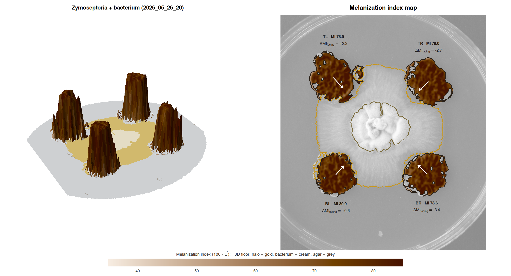

# MycoHalo

**Colour-calibrated quantification of fungal melanization in confrontation assays**

MycoHalo measures the melanization of *Zymoseptoria tritici* colonies
inoculated at fixed positions on a Petri dish, either alone (controls) or
confronted with a bacterium in the centre. It gives you per-colony size and
shape, a calibrated melanization index with confidence intervals,
edge-to-centre melanization profiles, side-specific melanization facing the
bacterium, growth inhibition, halo geometry, and a quality-control figure for
every plate.

<p align="center"></p>

## Why not grayscale?

Grey fungal colonies, the cream-white bacterial colony and its yellowish
diffusion halo overlap in grayscale brightness, and strongly melanized
colonies can have almost the mean colour of dark agar. MycoHalo therefore:

1. works in **CIE L\*a\*b\*** after **flat-field illumination correction**
   and optional **grey-card calibration**;
2. detects objects by **colour *and* texture**;
3. classifies fungus / bacterium / halo with a **layout-initialised,
   noise-aware mixture** of colour direction, colour magnitude and texture;
4. separates the cultures sharing one dish with a **seeded watershed** that
   starts from colony cores matched to the known inoculation layout.

## Installation

```r
# install.packages("remotes")
remotes::install_github("mghotbi/MycoHalo", build_vignettes = TRUE)
```

MycoHalo contains C++ code (Rcpp). On macOS this needs the Xcode command
line tools (`xcode-select --install`), and on Windows it needs Rtools. There
is no Bioconductor dependency.

## Quick start

```r
library(MycoHalo)

# confrontation plate: TL, TR, BR, BL Zymoseptoria + central bacterium
res <- analyze_plate("2026_05_26_20.JPG")
plot_qc(res)            # always inspect
plot_melanization_map(res)   # 3D landscape + 2D melanization map
res$colonies            # one row per colony
res$profiles            # edge-to-centre rings
res$plate_summary       # scale, bacterium, halo, QC

# control plate
ctrl <- analyze_plate("2026_05_26_37.JPG", layout = plate_layout(centre = "none"))

# a whole experiment: 1) metadata sheet, 2) batch analysis
make_metadata("photos", treatment = "bacteria", patterns = c(control = "ctrl"))
#   -> edit photos/plate_metadata.csv (treatment = "control" for plates without bacterium)
meta <- read.csv("photos/plate_metadata.csv")
out  <- analyze_plates("photos", metadata = meta, layout = layout_by_treatment, qc_dir = "qc")
out$colonies <- correct_facing_bias(out$colonies)
compare_melanization(out$colonies, group = "treatment", reference = "control")
```

A ready-to-edit lab script and metadata template:

```r
file.copy(system.file("scripts", c("analyse_experiment.R", "plate_metadata_example.csv"),
                      package = "MycoHalo"), ".")
```

Try it without photos:

```r
sim <- simulate_plate(seed = 1)
res <- analyze_plate(sim$image)
plot_qc(res)
```

## Key outputs

| | |
|---|---|
| `MI_mean` (± block-bootstrap CI) | melanization index = 100 − L\* (higher = darker) |
| `gray_imagej` | mean grey value as in ImageJ/Fiji, for comparison with older data |
| `delta_MI_facing` | melanization of the colony half facing the bacterium − the opposite half |
| `growth_inhibition_pct` | percent inhibition of radial growth towards the bacterium |
| `gap_halo_mm`, `halo_outer_radius_mm`, `halo_delta_b` | halo contact and geometry |
| `area_mm2`, `circularity`, `solidity` | colony size and shape |

## Accuracy

Validated on simulated plates with known ground truth across 13 scenarios
(vignetting, exposure error, very dark colonies, touching colonies, missing
colonies, halos over colonies, noise). Colony area is within ~2.2 % (typically
< 1 %) and melanization within 0.9 L\* units, and missing colonies are reported rather
than invented. See `vignette("MycoHalo")` and `inst/validation/`. The pipeline has also been
checked on real *Z. tritici* control and bacterium-confrontation photographs.

## Photography matters

Use a copy stand, diffuse light, manual exposure and white balance, a dark
matte background, a small 18 % grey card in every photo, and a mark at 12
o'clock on each dish. See section 2 of the vignette.

## Citation

Ghotbi M. MycoHalo: colour-calibrated quantification of fungal melanization
in confrontation assays. R package version 0.1.0.
https://github.com/mghotbi/MycoHalo
